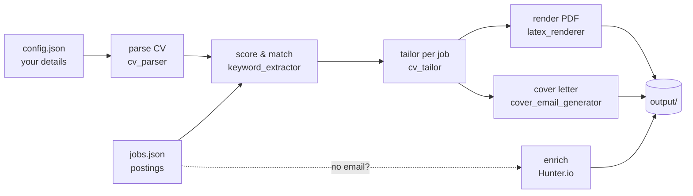

# CV Autopilot

**Stop sending the same CV to every job.** CV Autopilot reads each job description, scores how well you fit, and generates a tailored CV + matching cover letter per role — automatically.

[](https://github.com/NotMarwan/cv-autopilot/actions/workflows/tests.yml)


🐍 Pure Python · 📄 LaTeX PDF output · 🌍 Bilingual Arabic/English · 🔒 Your data never leaves your machine

---

## Why it exists

A graduate applies to 50+ roles with one generic CV and hears nothing. The roles aren't the
problem — the **generic CV** is. Recruiters and ATS filters reward CVs that mirror the job's own
language. Doing that by hand for every posting is hours of tedious work, so nobody does it.

CV Autopilot does it in seconds: one base CV in, a tailored CV + cover letter per job out.

## How it works



1. **Parse your CV** (LaTeX or plain text) into structured JSON
2. **Score every job** — keyword taxonomy across 10 categories (networking, security, cloud, PM, banking, software, telecom, certifications…), Arabic + English
3. **Tailor per job** — reordered skills, role-matched summary, most relevant experience surfaced
4. **Render professional PDFs** via LaTeX — one per job
5. **Generate role-aware cover letters** — 6 role categories, each emphasising different projects
6. **Find recruiter emails** — optional [Hunter.io](https://hunter.io) enrichment by company domain

## What it looks like in practice

In its first real run — the author's own Saudi-market graduate job search — CV Autopilot:

| | |
|---:|:---|
| **392** | job postings parsed and scored |
| **29** | tailored CVs generated from a single base CV |
| **10** | keyword categories matched (bilingual AR/EN) |
| **6** | role-specific cover-letter templates |
| **19** | automated tests, green on CI across Python 3.10–3.12 |

## Quickstart

```bash
git clone https://github.com/NotMarwan/cv-autopilot
cd cv-autopilot
pip install -r requirements.txt

python setup_wizard.py        # enter your details once (writes config.json — stays local)
python src/pipeline.py        # tailored CVs ready in output/
```

### Requirements
- Python 3.10+
- For PDF output: a LaTeX distribution with `xelatex` ([MiKTeX](https://miktex.org/) on Windows, `texlive-xetex` on Linux). Skip with `--no-pdf` to get `.tex` files you can compile on [Overleaf](https://overleaf.com).

## Providing jobs

The pipeline reads jobs from a JSON file (`scratch/scraped_wadhefa_jobs.json` by default). Each job is:

```json
{
  "title": "Network Engineer",
  "company": "Acme Corp",
  "description": "...",
  "requirements": "CCNA, routing, switching...",
  "location": "Riyadh",
  "status": "Open",
  "emails": ["hr@acme.com"],
  "url": "https://..."
}
```

Build it however you like — paste jobs by hand, export from a job board, or write a scraper.

## Email enrichment (optional)

If a posting has no contact email, add a [Hunter.io](https://hunter.io) API key in `config.json` (free tier: 25 searches/month):

```bash
PYTHONPATH=src python src/enrich_emails.py          # dry run
PYTHONPATH=src python src/enrich_emails.py --write  # save found emails
```

## Pipeline steps

```bash
python src/pipeline.py                 # run everything
python src/pipeline.py --step parse    # just parse your CV
python src/pipeline.py --step match    # just the match report
python src/pipeline.py --step tailor   # just tailor CVs
python src/pipeline.py --step render   # just render PDFs
python src/pipeline.py --no-pdf        # skip PDF compilation
python src/pipeline.py --llm           # Claude-powered summary rewriting (needs ANTHROPIC_API_KEY)
```

## Tests

```bash
PYTHONPATH=src python -m pytest tests/ -q
```

Every push runs the suite on Python 3.10, 3.11, and 3.12 via GitHub Actions (badge above).

## Privacy

Your personal data lives in `config.json`, which is **gitignored** — it never leaves your machine.
The repo ships only `config.example.json` as a template. CV Autopilot generates documents; it does
**not** send email on your behalf.

## Author

Built by **Marwan Salah** — Computer Engineering & Networks graduate, CCNA-certified — as a real
tool for a real Saudi-market job search, not a toy demo.

- GitHub: [@NotMarwan](https://github.com/NotMarwan)

If CV Autopilot helps your search, a ⭐ on the repo is appreciated.

## License

[MIT](LICENSE) © 2026 Marwan Salah
